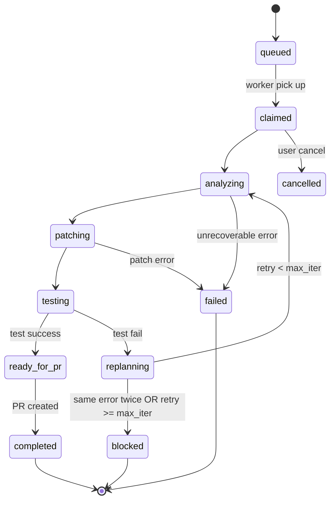

# 目的

GitHub Issue を読み取り、修正・テスト・再試行を繰り返し、最終的に Draft PR を作成するシステムを構築する。

本システムは以下の3つの起点から実行可能であること：

1. MCP 経由のリクエスト
2. cron による定期実行
3. HTTP API によるジョブ投入

---

# 基本設計方針

## 最重要原則

* 実行ロジックは「Job Engine」に集約する
* MCP / API / cron はすべて入口として扱う
* ロジックの重複は禁止

---

# システム構成

以下のコンポーネントを実装すること：

* Job Engine（状態管理・実行制御）
* GitHub Adapter（Issue / PR / コメント操作）
* Workspace Runner（checkout / patch / test）
* Model Broker（モデル切替・呼び出し）
* State Store（DB）
* MCP Gateway
* HTTP API Gateway
* Cron Scanner

---

# ジョブ状態遷移

## 状態遷移図



## 状態一覧

*   `queued`: ジョブ投入直後、未実行。
*   `claimed`: ワーカーがジョブを確保。
*   `analyzing`: Issue の内容とコードの解析中。
*   `patching`: 修正パッチの生成・適用中。
*   `testing`: パッチ適用後のテスト実行中。
*   `replanning`: テスト失敗後の原因分析と方針修正中。
*   `ready_for_pr`: テスト成功、PR作成待ち。
*   `blocked`: 同一エラー再発または最大試行回数到達により停止。要手動介入。
*   `completed`: Draft PR 作成完了。正常終了。
*   `failed`: 続行不能な致命的エラーで異常終了。
*   `cancelled`: ユーザーによる明示的な中断。

---

# 実行ループ

以下の手順を繰り返すこと：

1. Issue を取得
2. コードを解析
3. 修正パッチを生成
4. パッチ適用
5. テスト実行
6. 失敗した場合：

   * エラー分析
   * 再計画
   * 再実行
7. 成功した場合：

   * Draft PR 作成
8. 同一エラーが2回発生した場合：

   * blocked に遷移

---

# 制約条件

* 最大試行回数：5回
* タイムアウト：30分
* 同一エラー2回で停止

---

# ジョブデータ構造 & DBスキーマ

State Store は SQLite をデフォルトとし、以下のテーブルで管理する。

### jobs テーブル

| カラム | 型 | 説明 |
| :--- | :--- | :--- |
| `job_id` | TEXT (PK) | UUID または識別文字列 |
| `state` | TEXT | 現在の状態（上記一覧参照） |
| `entrypoint` | TEXT | `mcp`, `api`, `cron` |
| `repo_owner` | TEXT | リポジトリ所有者 |
| `repo_name` | TEXT | リポジトリ名 |
| `issue_number` | INTEGER | 対象 Issue 番号 |
| `current_iteration` | INTEGER | 現在の試行回数 (0-5) |
| `max_iterations` | INTEGER | 最大試行回数 (デフォルト 5) |
| `last_error_hash` | TEXT | 同一エラー判定用のハッシュ |
| `config` | JSON | LLM設定、Provider, タイムアウト、`draft_pr` フラグ等 |
| `created_at` | DATETIME | 作成日時 |
| `updated_at` | DATETIME | 最終更新日時 |

### job_steps テーブル (実行履歴)

| カラム | 型 | 説明 |
| :--- | :--- | :--- |
| `step_id` | INTEGER (PK) | 自動採番 |
| `job_id` | TEXT (FK) | `jobs.job_id` |
| `state` | TEXT | 実行時の状態 |
| `output` | TEXT | 実行時のログ、生成したパッチ、またはテスト結果 |
| `created_at` | DATETIME | 記録日時 |

---

# エラー同一性判定ロジック

「同一エラーが2回発生した場合に停止」の基準を以下の通り定義する。

1.  **ハッシュ生成**: エラーメッセージから変動要素（ファイルパス、行番号、メモリアドレス、タイムスタンプ等）を正規表現で除外し、平滑化した文字列の `SHA-256` ハッシュを生成する。
2.  **記録**: 各試行でテストが失敗した際、このハッシュを `last_error_hash` に保存する。
3.  **比較**: 次の試行で再度のテスト失敗が発生した場合、新たなエラーのハッシュが `last_error_hash` と一致すれば「同一エラー」と見なし、状態を `blocked` に遷移させる。

---

# エントリーポイント仕様

## 1. HTTP API

FastAPI を使用し、以下のエンドポイントを実装する。

### `POST /v1/jobs/issues/start`
新規修正ジョブを開始する。
**Request:**
```json
{
  "repo": "owner/name",
  "issue_number": 123,
  "config": {
    "model": { "mode": "shared", "provider": "openai", "name": "gpt-4-turbo" },
    "max_iterations": 5
  }
}
```

### `POST /v1/sessions`
セッション認証用 API キーを保存せずに一時保持する。
**Request:** `{ "provider": "openai", "api_key": "sk-..." }`
**Response:** `{ "session_id": "uuid-temp" }` (有効期限1時間)

### その他エンドポイント
* `POST /v1/jobs/issues/resume`: `{ "job_id": "..." }`
* `GET /v1/jobs/{job_id}`: ステータスと簡易ログを返却。
* `POST /v1/jobs/{job_id}/cancel`: ジョブを中断。

認証：

* Authorization: Bearer <job-api-key>

---

## 2. MCP Gateway

以下のツールを公開する：

* start_issue_fix
* resume_issue_fix
* get_job_status
* cancel_job

以下のリソースを公開する：

* job://{id}/summary
* job://{id}/logs
* job://{id}/diff
* job://{id}/test-report

---

## 3. Cron Scanner

15〜30分間隔で実行する。

対象 Issue 条件：

* state=open
* label=agent-ready
* label!=blocked
* label!=agent-working

処理内容：

* Issue をロック
* Job をキューに追加
* 重複実行を防ぐ

---

# モデル管理

モデルは以下の3モードをサポートする：

* shared：サーバー共通モデル
* local：ローカルモデル
* session：クライアント提供の一時認証

重要：

* APIキーをデータベースに保存・永続化してはならない。
* `session` モードでは、`/v1/sessions` で発行された `session_id` に紐づく API キーをインメモリー（キャッシュ）でのみ保持し、ジョブの終了またはタイムアウト時に即座に破棄すること。

---

# セキュリティ制約（必須）

以下は絶対禁止：

* main / master への直接 push
* force push
* merge
* deploy
* secret の変更

許可する操作：

* 指定されたリポジトリでの `git worktree` 作成
* ローカルブランチへの commit
* 開発ブランチの作成および Draft PR 作成のみ

コマンド実行制約：
* テスト実行コマンドの最大実行時間制限 (例: 5分)
* メモリ使用制限 (ulimit 等による制限を推奨)
* ファイル書き換えのディレクトリ範囲制限

---

# 実装優先順位

以下の順序で実装すること：

1. Job Engine（CLIから実行可能にする）
2. GitHub連携
3. Patch + Test ループ
4. HTTP API
5. Cron Scanner
6. MCP Gateway
7. Session認証
8. クライアント統合

---

# 成功条件

以下を満たすこと：

* Issue から Draft PR まで自動到達できる
* 同一 Issue の重複処理が発生しない
* エラー時に blocked に遷移する
* 危険操作が一切実行されない

---

# 出力要求

* ディレクトリ構成
* 主要モジュールコード
* API仕様（OpenAPI）
* MCPツール定義
* データベーススキーマ
* サンプル実行手順

推測せず、明示された仕様に厳密に従うこと。
